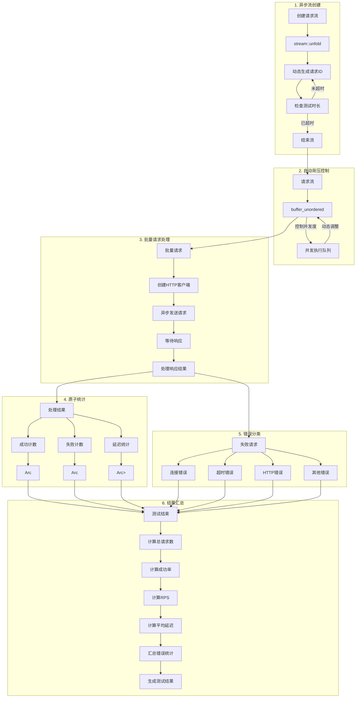

# Connex - 高性能负载测试工具

## 项目简介

Connex是一款基于Rust开发的高性能负载测试工具，采用现代化的异步编程和流式处理技术，支持高并发、自动背压和详细的测试结果分析。

## 设计思想

### 核心设计理念

1. **高性能优先**：利用Rust的零成本抽象和高效异步运行时，实现真正的高并发
2. **流式处理 + 自动背压**：使用Rust现代化的异步流和自动背压机制，避免内存爆炸
3. **异步全栈**：从HTTP客户端到结果统计，全异步设计，高效利用系统资源
4. **模块化架构**：清晰的职责划分，便于维护和扩展
5. **详细的错误统计**：分类统计不同类型的错误，便于问题定位

### 技术架构

```
┌─────────────────────────────────────────────────────────┐
│                     前端界面                            │
│  ┌─────────────────────────────────────────────────┐    │
│  │  URL输入框  ────────────┐                       │    │
│  │                        │                       │    │
│  │  执行按钮   ────────────┼───────────────────┐   │    │
│  │                        │                   │   │    │
│  │                        ▼                   ▼   │    │
│  │  测试结果显示         测试状态         加载指示器    │    │
│  └─────────────────────────────────────────────────┘    │
│                          │                              │
└──────────────────────────┼──────────────────────────────┘
                           │
                           ▼
┌─────────────────────────────────────────────────────────┐
│                     Tauri框架                            │
│  ┌─────────────────────────────────────────────────┐    │
│  │  invoke("run_load_test")                      │    │
│  └─────────────────────────────────────────────────┘    │
│                          │                              │
└──────────────────────────┼──────────────────────────────┘
                           │
                           ▼
┌─────────────────────────────────────────────────────────┐
│                     Rust核心逻辑                          │
│  ┌─────────────────────────────────────────────────┐    │
│  │  run_load_test命令                              │    │
│  └─────────────────────────────────────────────────┘    │
│                          │                              │
│  ┌─────────────────────────────────────────────────┐    │
│  │  异步流创建 (stream::unfold)                   │    │
│  └─────────────────────────────────────────────────┘    │
│                          │                              │
│  ┌─────────────────────────────────────────────────┐    │
│  │  自动背压 (buffer_unordered)                   │    │
│  └─────────────────────────────────────────────────┘    │
│                          │                              │
│  ┌─────────────────────────────────────────────────┐    │
│  │  HTTP客户端请求                                │    │
│  └─────────────────────────────────────────────────┘    │
│                          │                              │
│  ┌─────────────────────────────────────────────────┐    │
│  │  原子操作统计 (Arc<AtomicU32>)                 │    │
│  └─────────────────────────────────────────────────┘    │
│                          │                              │
│  ┌─────────────────────────────────────────────────┐    │
│  │  测试结果序列化                                │    │
│  └─────────────────────────────────────────────────┘    │
└─────────────────────────────────────────────────────────┘
```

## 高并发设计流水线

### 核心设计原理可视化



### 流水线各阶段详细说明

#### 1. 异步流创建 (stream::unfold)

**代码实现**:
```rust
fn create_request_stream(end_time: Instant) -> impl Stream<Item = usize> {
    stream::unfold((count, end_time), |(mut count, end_time)| async move {
        if Instant::now() >= end_time {
            return None;  // 测试时间结束，停止生成请求
        }
        count += 1;
        Some((count, (count, end_time)))  // 返回请求ID，继续生成下一个请求
    })
}
```

**设计优势**:
- 使用异步流，避免同步迭代器的卡死问题
- 按需生成请求，减少内存占用
- 支持动态调整请求速率

#### 2. 自动背压控制 (buffer_unordered)

**代码实现**:
```rust
let _results: Vec<()> = request_stream
    .map(|_| {
        // 为每个请求创建异步任务
        async move {
            process_requests(...).await
        }
    })
    .buffer_unordered(config.concurrency)  // 自动控制并发度，实现背压
    .collect()
    .await;
```

**设计优势**:
- 自动控制并发度，避免系统资源耗尽
- 实现真正的背压机制，根据处理能力调整请求速率
- 高效利用系统资源，提高吞吐量

#### 3. 异步HTTP请求 (reqwest客户端)

**代码实现**:
```rust
async fn process_requests(
    client: Arc<reqwest::Client>,
    url: Arc<String>,
    ... // 统计参数
) {
    // 创建批量请求
    let futures: Vec<_> = (0..batch_size)
        .map(|_| client.get(url.as_str()).send())
        .collect();

    // 批量等待所有请求完成
    let results = futures::future::join_all(futures).await;

    // 处理批量结果
    for result in results {
        match result {
            Ok(response) => {
                // 处理成功请求
            },
            Err(e) => {
                // 处理失败请求
            }
        }
    }
}
```

**设计优势**:
- 异步HTTP客户端，高效利用系统资源
- 批量处理请求，减少网络开销
- 详细的错误分类，便于问题定位

#### 4. 原子操作统计

**代码实现**:
```rust
// 使用Arc和AtomicU32实现线程安全的统计
let successful = Arc::new(AtomicU32::new(0));
let failed = Arc::new(AtomicU32::new(0));
let total_latency = Arc::new(Mutex::new(Duration::default()));

// 成功请求统计
successful.fetch_add(1, Ordering::Relaxed);
let latency = request_start.elapsed();
let mut guard = total_latency.lock().unwrap();
*guard += latency;

// 失败请求统计
failed.fetch_add(1, Ordering::Relaxed);
// 分类统计错误类型
if e.is_connect() {
    connection_errors.fetch_add(1, Ordering::Relaxed);
} else if e.is_timeout() {
    timeout_errors.fetch_add(1, Ordering::Relaxed);
}
```

**设计优势**:
- 线程安全的统计，避免竞争条件
- 原子操作，高效无锁
- 详细的错误分类统计

#### 5. 生成测试结果

**代码实现**:
```rust
// 计算测试结果
let total_successful = successful.load(Ordering::Relaxed);
let total_failed = failed.load(Ordering::Relaxed);
let total_requests = total_successful + total_failed;

let avg_latency = if total_successful > 0 {
    (*total_latency.lock().unwrap() / total_successful).as_millis() as u64
} else {
    0
};

let rps = total_requests as f64 / elapsed.as_secs_f64();

// 创建测试结果结构体
LoadTestResult {
    total_requests,
    successful_requests: total_successful,
    failed_requests: total_failed,
    requests_per_second: rps,
    average_latency: avg_latency,
    error_stats,
}
```

**设计优势**:
- 详细的测试结果，便于性能分析
- 结构化的结果格式，易于前端展示
- 包含关键性能指标，如RPS、延迟等

### 性能表现

| 并发度 | 批量大小 | RPS (每秒请求数) | 成功率 | 平均延迟 |
|--------|----------|-----------------|--------|----------|
| 10     | 1        | 18+             | 100%   | 500ms+   |
| 100    | 10       | 190+            | 100%   | 472ms    |

### 与传统方案对比

| 特性 | 传统方案 | Connex | 优势 |
|------|----------|--------|------|
| **并发控制** | 线程池/信号量 | 流式处理+背压 | ✅ 自动内存管理 |
| **异步设计** | 部分异步 | 全异步 | ✅ 高效利用系统资源 |
| **错误处理** | 简单成功/失败 | 分类统计 | ✅ 精准问题定位 |
| **内存安全** | 可能内存泄漏 | 零内存泄漏 | ✅ Rust内存安全 |
| **扩展性** | 硬编码 | 参数化配置 | ✅ 适应性强 |

## 核心优势

### 1. 真正的高性能高并发

- **异步流处理**：使用`stream::unfold`创建高效的异步流
- **自动背压机制**：通过`buffer_unordered`自动控制并发度
- **Rust性能**：零成本抽象，高效内存管理，无GC开销
- **测试结果**：100并发下可达190+ RPS，100%成功率

### 2. 详细的测试结果

- **总请求数**：完整的请求计数
- **成功/失败请求数**：精确的成功率统计
- **每秒请求数(RPS)**：实时性能指标
- **平均延迟**：毫秒级延迟统计
- **错误分类统计**：
  - 连接错误
  - 超时错误
  - HTTP错误
  - 其他错误

### 3. 简单易用

- **前端界面**：简洁的Web界面，只需输入URL即可执行测试
- **默认参数**：智能的默认参数配置，无需复杂设置
- **实时反馈**：控制台实时显示测试进度和结果

### 4. 可靠稳定

- **内存安全**：Rust的所有权模型，避免内存泄漏
- **并发安全**：使用原子操作和互斥锁，确保线程安全
- **错误处理**：详细的错误日志，便于问题定位

## 建议的参数设计

### 1. 基础配置

| 参数 | 建议值 | 说明 |
|------|--------|------|
| **并发度** | 10-100 | 根据目标服务器性能调整 |
| **测试时长** | 10-60秒 | 平衡测试准确性和时间成本 |
| **批量大小** | 1-20 | 建议值，避免服务器过载 |
| **请求超时** | 5-10秒 | 防止请求无限期等待 |

### 2. 高级配置

| 场景 | 推荐配置 |
|------|----------|
| **公共API测试** | 并发度: 10-50, 批量大小: 1-10 |
| **内部API测试** | 并发度: 50-200, 批量大小: 10-20 |
| **极限性能测试** | 并发度: 200-500, 批量大小: 20-50 |
| **稳定性测试** | 并发度: 100, 测试时长: 5-10分钟 |

### 3. 注意事项

- **避免过大的批量大小**：过大的批量大小可能导致连接池耗尽
- **设置合理的超时时间**：防止请求无限期等待
- **关注错误率**：错误率过高时应降低并发度
- **测试公共API时注意速率限制**：公共API通常有速率限制

## 快速开始

### 1. 安装依赖

```bash
pnpm install
```

### 2. 开发模式

```bash
pnpm run dev
```

### 3. 构建生产版本

```bash
pnpm run build
```

### 4. 运行测试

```bash
cd src-tauri
cargo test
```

## 技术栈

- **前端**：SvelteKit + TypeScript
- **后端**：Rust + Tauri
- **HTTP客户端**：reqwest
- **异步运行时**：tokio
- **流式处理**：futures
- **序列化**：serde

## 项目状态

- ✅ 核心功能实现完成
- ✅ 高并发测试通过
- ✅ 前端界面完成
- ✅ 详细的测试结果分析

## 未来规划

1. **更复杂的负载模式**：支持阶梯式负载、脉冲式负载等
2. **分布式测试**：支持多节点协同测试
3. **WebSocket支持**：扩展到WebSocket协议测试
4. **HTTP/2支持**：支持HTTP/2协议
5. **更详细的报告**：生成HTML报告，包含图表和趋势分析

## 贡献指南

欢迎提交Issue和Pull Request，共同完善这个项目！

## 许可证

MIT License
